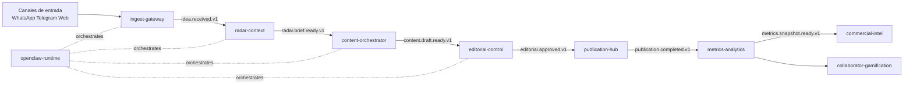

# Arquitectura Operativa CREA (v1)

## 1. Objetivo

Definir una arquitectura operativa robusta, escalable y auditable para CREA, donde IA y equipo editorial colaboren sin perder control humano sobre publicacion y calidad.

## 2. Evaluacion del estado actual

Fortalezas detectadas:
- Estructura tipo monorepo ya separada en apps, services, packages y docs.
- Frontend organizado y desacoplado.
- Espacios reservados para crecimiento por dominios.

Brechas que deben corregirse:
- No existe contrato de eventos para el flujo editorial.
- No hay definicion de SLO/SLA operativos.
- No hay runbooks para incidentes ni fallback de modelos IA.
- No hay separacion formal por bounded context en backend.
- Falta gobierno de costos IA y trazabilidad de decisiones editoriales.

## 3. Principios no negociables

1. Human-in-the-loop obligatorio en decisiones editoriales criticas.
2. Event-driven para desacoplar modulos y escalar por dominio.
3. Observabilidad first (logs, metricas, trazas, costo por flujo).
4. Security and privacy by default.
5. Versionado de contratos (eventos y APIs) desde v1.
6. Degradacion controlada ante caidas de cloud IA.

## 4. Arquitectura objetivo por modulos

### 4.1 Mapeo funcional

- Captura de ideas -> service: ingest-gateway
- Analisis de contexto (RADAR) -> service: radar-context
- Produccion de contenido -> service: content-orchestrator
- Control editorial y aprobacion -> service: editorial-control
- Publicacion -> service: publication-hub
- Metricas -> service: metrics-analytics
- Comercial y oportunidades -> service: commercial-intel
- Colaboradores + gamificacion -> service: collaborator-gamification
- Orquestacion 24/7 de agentes IA -> service: openclaw-runtime

### 4.2 Flujo operativo (alto nivel)

1. Idea entra por WhatsApp/Telegram/API.
2. Ingest normaliza, clasifica y emite evento idea.received.v1.
3. RADAR enriquece contexto y emite radar.brief.ready.v1.
4. Produccion IA genera draft y emite content.draft.ready.v1.
5. Editorial-control valida y aprueba/rechaza.
6. Publication-hub publica en web/canales.
7. Metrics-analytics calcula impacto.
8. Commercial-intel detecta oportunidades.
9. Collaborator-gamification actualiza puntajes.

## 5. Diagrama operativo

## 6. Arquitectura de datos

Almacenamientos recomendados:
- Postgres: fuente canonica de negocio (ideas, notas, aprobaciones, contratos, usuarios).
- Object storage: multimedia, adjuntos, audios y versiones de artefactos.
- Queue/Broker: bus de eventos (RabbitMQ/NATS/Kafka, segun throughput).
- Search index: busqueda editorial y analitica textual.

Politicas clave:
- Idempotencia por event_id.
- Retencion de eventos y snapshots.
- Trazabilidad de autoria humana/IA por cada nota.

## 7. Estrategia IA hibrida

Reglas de ruteo:
- Modelo local: transcripcion, clasificacion, resumen preliminar, deteccion de duplicados.
- Modelo cloud premium: redaccion final, refinamiento editorial, copy comercial de alto impacto.

Control de costo:
- Presupuesto por flujo y por modulo.
- Alertas cuando costo por nota supere umbral.
- Politica de fallback automatica a modelo local en tareas no criticas.

## 8. Confiabilidad y operacion

SLO iniciales sugeridos:
- Disponibilidad plataforma operativa: 99.5% mensual.
- Latencia p95 de ingest -> draft: <= 8 min.
- Publicacion tras aprobacion: <= 60 seg.
- Perdida de eventos: 0 (con reintentos y DLQ).

Mecanismos:
- Retry con backoff exponencial.
- Dead-letter queue por dominio.
- Circuit breaker para servicios cloud.
- Health checks y readiness probes.

## 9. Seguridad y cumplimiento

- RBAC por rol (editor, operador, comercial, admin).
- Secret management centralizado.
- Cifrado en transito y en reposo.
- Auditoria de cambios editoriales (quien aprobo, cuando, por que).
- Revision legal automatica previa a publicacion en notas sensibles.

## 10. Escalabilidad y versionado

- Escalado horizontal por consumidor de eventos en cada servicio.
- Contratos versionados: idea.received.v1, v2, etc.
- Feature flags para rollout gradual.
- Separacion por dominios para despliegues independientes.

## 11. Checklist de salida a produccion

1. Contratos de eventos validados.
2. SLO y dashboards activos.
3. Runbooks probados con simulacros.
4. Fallback IA validado en carga real.
5. Seguridad, backup y restauracion probados.
6. Gate editorial activo y obligatorio.
